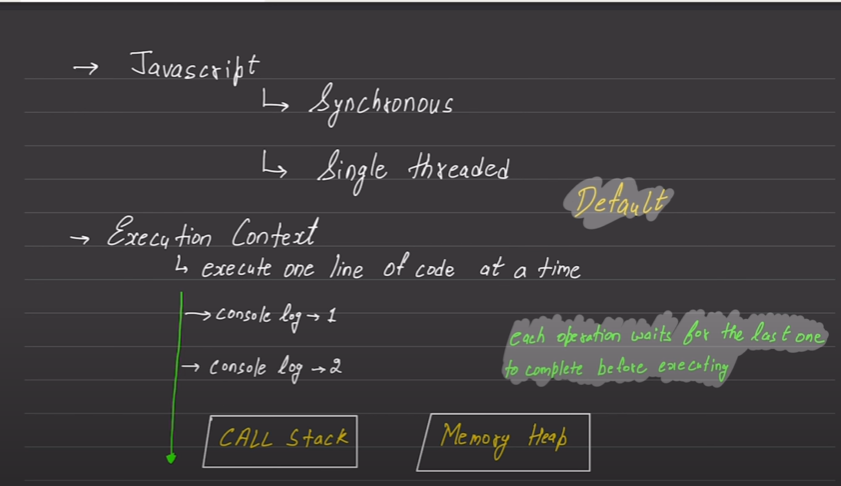
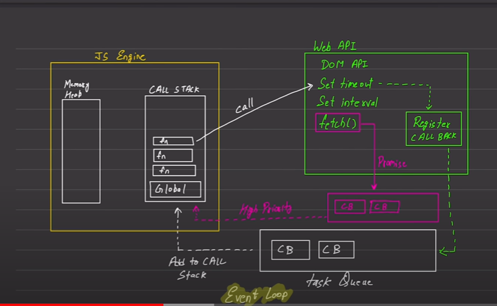

Note:- By Default every thing in java Script is a object.
```
Q1. What is Prototype?
Ans:- It is the group of method and Properties which javaScript binds in an single Object and attached to our original Array means that array which me created. and once its attached we can us that proprty and methods in objects , Arraysx Strings and Functions.
```


```
Q2: Java Script is which Typed Language?
Ans:- javaScript is Dynamically-typed languages are those (like JavaScript) where the interpreter assigns variables a type at runtime based on the variable's value at the time
```
```
Q3: Types of Java Script Object?
Ans:- JAva Script Objects are of two types 1: Object Literals ,2:- Single Ton or Constructor.
```
```
Q4: What is this Key Word means?
Ans:- this keyword means (current context) if we want to access the value in the object through function we use this keyword.
```
```
Q5: Synatx fro creating object, Array, Date through new KeyWord?
Ans:- let variable = new [Array,Date,Objet] ()
```
```
Q6 : Syntax For Creating Map ?
Ans : let a = new map() /
a.set('name','Aditya Singh')
a.set('Address','xyz')

it return Array
```

```
Important Notes:- About Events

In Events we pass three parameters

for example :- we have to access some object and apply event on it

let a = document.querySelector(".Aditya")
a.addEventListner('click',()=>{

},true or false) //
1.by default it is false : false is Event Bubbling meand if some event is applied on both parent and children the its goes from child to parent.
2.True :- Event Capturing in event Capturing if events applied on both parent and clidren then on click events occurs from parent to children.

3.eventPrevention() : Its a method to avoid EventBubblind and EventCapturing
```

```
Q7: What is Java Script ?
Ans:- Java Script is a Single Threaded , Synchronous Language means JavaCcript can execute one command at a time and ony in a specific order.
```



```
Q8 :- Java Script DataType?
Ans:- There are two Data types in Java Script:
1.Primitive 2. Non Primitive
-Number - Object
-Boolen - Array
-String
-BigInt
-null
-undefined
-symbol
```
```
Q9: What are Two types of Memory?
Ans:- 1.Stack Memory- Primitive DataType -- it provide the copy of of variable which we created.
2.Heap Memory - Non-Primitive -- it provide the refrence if we want to change variable it change the whole variable.
```
```
Q10: How many types of loops in JS?
Ans1.for loop 2.forof 3.forin 4.forEach
```
```
Q11:Higher order Function?
Ans:- Map(),Filter(),Reduce() --> it is used in Array it takes a callback as arguments and return a new array with some operations.
```
```
Q12. What is callback?
Ans: A callBack is a function passed as an argument to another function or in Higher order function just like
map,filter and reduce.
```
```
Q13. Arrow Function?

Ans: Compact Way of writing a Fuction It was Introduced in ES6.(Ecma Script)
Syntax - let arrowfun = (para1,para2)=>{
function definition
}

arrowfun() --> call the arrow function (arrowfun --> it is refrence of function and it is arrowfun()-->
it is function call)
```
```
Q14:Some Important methods of Array.[]
Ans:-push(),pop(),slice(),splice(),spread,concat(),flat(),Array.from(argys),Array.of(args)
```
```
Q15:Some Important methods of Object.{}
Ans.Array.keys(), Array.values() it both retunn array of keys and values., Object.freeze(array name )
```
```
PROMISES:

Q15 : What is Promises ?

Ans:-It is a part of Async java Script where Promises have three state (pending,resolve,reject) when we fetch any api the its return promises we can resolve this promise by two ways . it is used to avoid callback hell.So we use Promise Chaining.

It have to three sate 1.Pending 2.resolve 3.reject

1.resolve if our api return a promise and that promise is resolved then we use dot then (.then(()=>)). its takes a callback.
2.eject if our api reject then we use dot catch(.catch()=>) its takes a callback.
3.it runs either sates are resolve or reject (.finally()=>) its takes a callback.

if something return from first .then it we use chaining because return value comes and stores in second .then.
ex : .then((e)=>{
return e.json()
}).then((result)=>{
console.log(result)
})
```
```
ASYNC AWAIT in Java Script:

if we fetch an api it returns a promise and that promise will either resolve or reject
for that puspose we use a Async Function and in Async function only in this function we use Await keyword basically. its works is it stops the executions of its neighbours only firstly that line will execute then all teh code is executed (its stops the execution of all the lines firstly that code is executed)

IN ASYNC AWAIT FUNCTION WE WRAPE OUR CODE IN

Example code async function fech(){

     try {
      let a = await fetch('https://cat-fact.herokuapp.com/facts')

      let b = await a.json()
      console.log(b.text);

    } catch (error) {
          console.log(error);

    }

     }
    fech()
 ```   

ASYNC JS DIAGRAM:

img


```
-- setTimeout() , and setinterval is function part of  ASYNC JavaScript .it have task queue. from where value is inserted in call stack.

--Fetch() have some high Priority its have high priority task queue from where value is inserted into call stack.
```